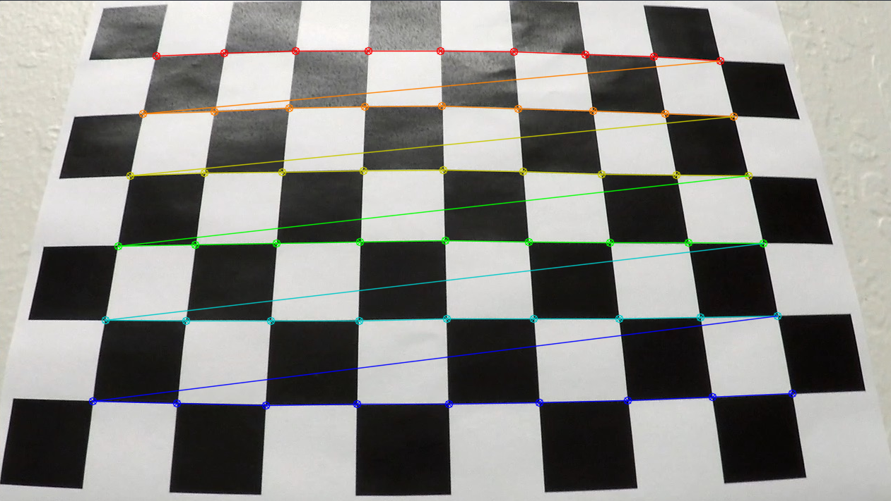
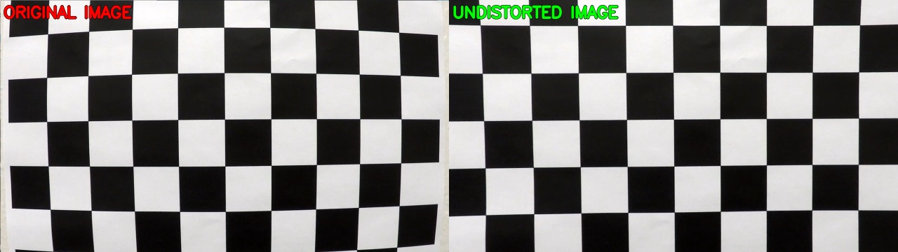
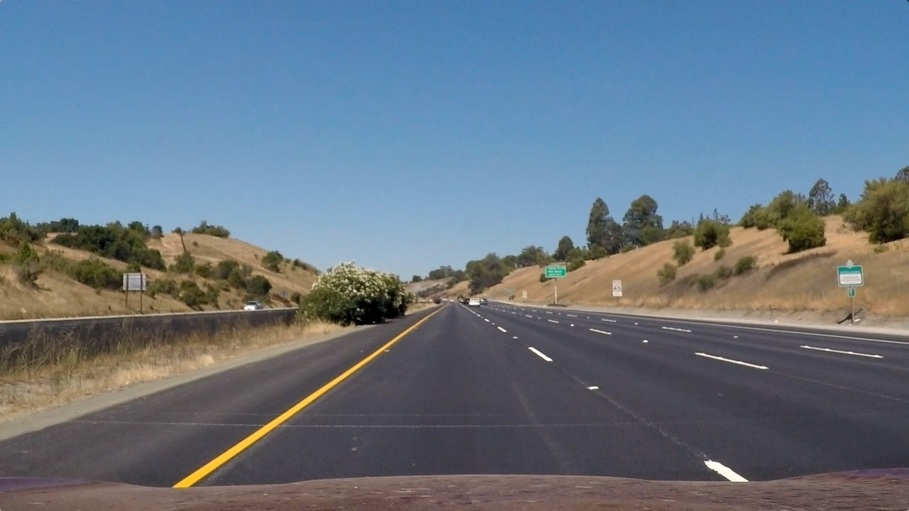
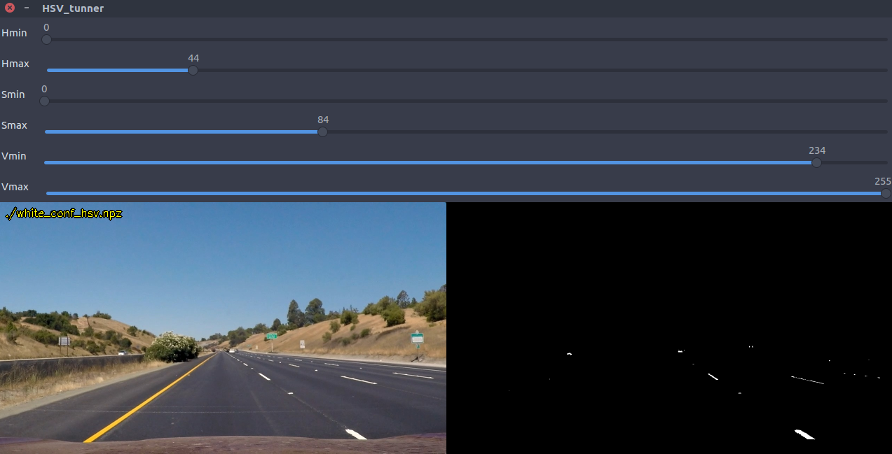
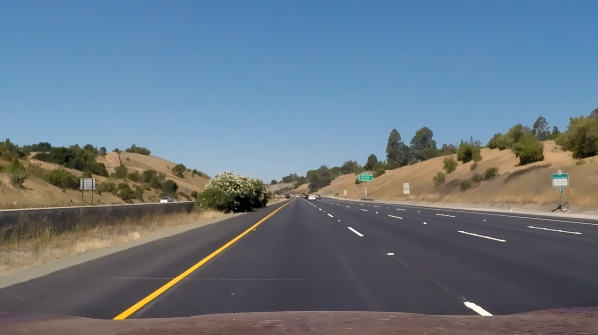
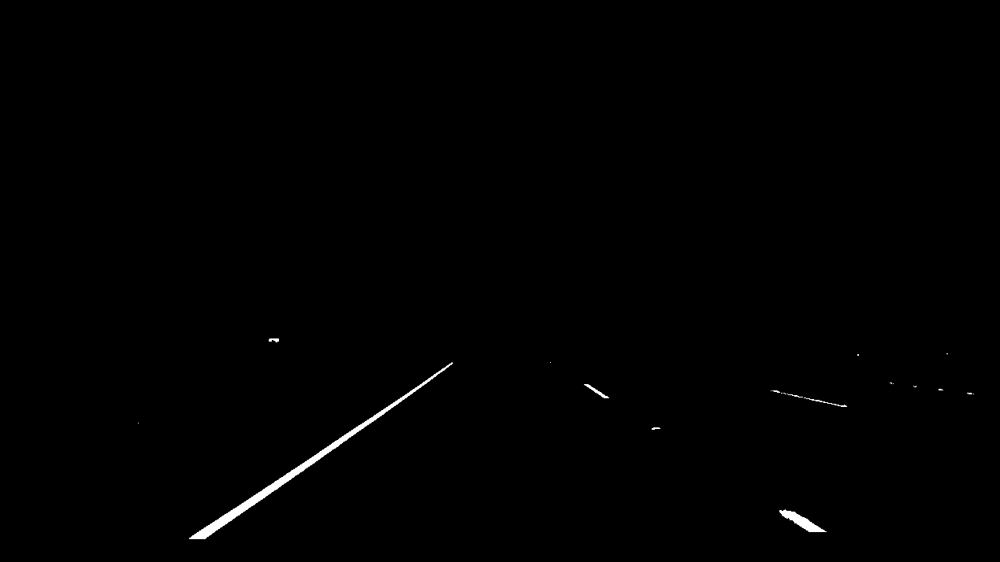
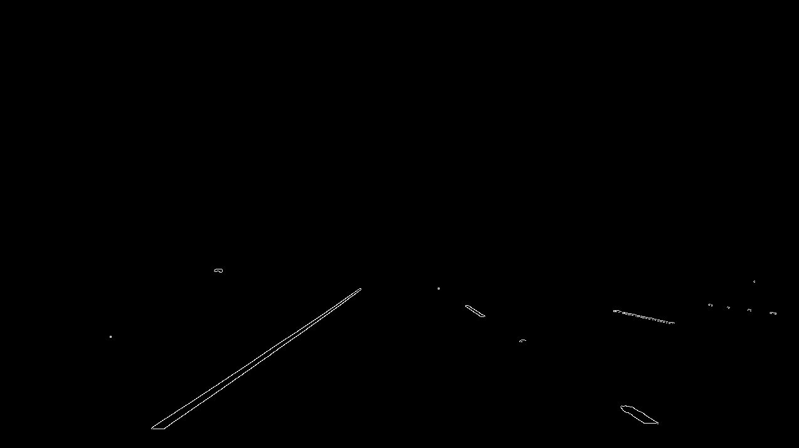
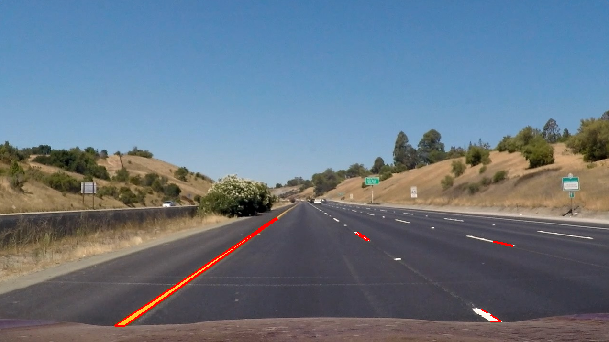
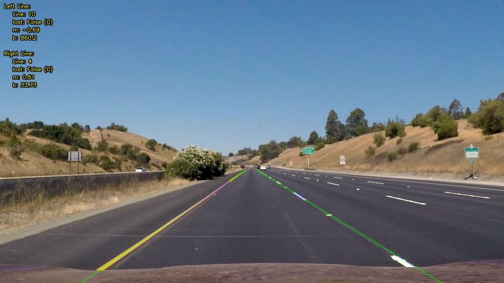

<!-- https://github.com/adam-p/markdown-here/wiki/Markdown-Cheatsheet#code -->
# **P2 - Advanced Road Lane Lines Finding** 

### **Description**

When we drive, we use our eyes to decide where to go. The lines on the road that show us where the lanes are act as our constant reference for where to steer the vehicle (depending on lines curvature). Naturally, one of the first things we would like to do in developing a self-driving car is to automatically detect lane lines using an algorithm, then extract some of their features. This project detect lane lines and curvature, finding a surface projection and a relation between images world and real world. I used the tools that I learned about in the lesson (Computer Vision Fundamentals, Camera Calibration, Gradients, Color Spaces, and advanced computer vision techniques from Udacity's Self driving car NanoDegree).

 

*Figure 1 - Result of curving lane lines finding process*

The goals / steps of this project are the following:

* Compute the camera calibration matrix and distortion coefficients given a set of chessboard images.
* Apply a distortion correction to raw images.
* Use color transforms, gradients, etc., to create a thresholded binary image.
* Apply a perspective transform to rectify binary image ("birds-eye view").
* Detect lane pixels and fit to find the lane boundary.
* Determine the curvature of the lane and vehicle position with respect to center.
* Warp the detected lane boundaries back onto the original image.
* Output visual display of the lane boundaries and numerical estimation of lane curvature and vehicle position.

<!-- [Rubric = https://review.udacity.com/#!/rubrics/571/view -->
---

### **Used Methods**

The tools that I used for pipeline are color spaces (HSV and HLS), regions of interest, Gaussian smoothing (filters), Canny Edge Detection, Hough LineTransform detection, Histograms peaks, sliding window, transformation matrix for surface projection and others. To achieve the goal was pieced together in a pipeline to detect the lane lines of each side of the road for images and videos. The curvatures of lines were calculated from linear regression of second order to later estimate the car's steering and position respect to road center.

---

### **How to run**

To run the pipeline just run in a prompt the command:

```clear && CarND-P2-Advanced_Lane_Lines_Finding.py```

Tested on: python 2.7 (3.X should work), OpenCV 3.0.0 (Higher version should work), UBUNTU 16.04.

Feel free to change any input argument of any function explained next.

---

### **Code Description**

### **1. Camera Calibration**

OpenCV functions and other methods were used to calculate the correct camera matrix and distortion coefficients using the calibration chessboard images provided in the repository (9x6 chessboard images). The distortion matrix was used to undistort one of the calibration images provided as a demonstration that the calibration is correct. 

The work is done by the function ```calibrate_camera()``` in ```CarND-P2-Advanced_Lane_Lines_Finding.py```. The arguments are:

Input Arguments:
* folder_path: `string` - Folder path with chessboard images
* calibration_file: `string` - Name of the file for saving or load parameters
* n_x: `int` - Number of vertical intersections in chessboard
* n_y: `int` - Number of horizontal intersections in chessboard
* show_draws: `boolean` - Enable/Disable show chessboard detections for every image

Returns:
* mtx: `numpy.narray` - camera distortion matrix
* dist: `numpy.narray` - camera distortion vector

Lets talk about this function. The variable ```object_points``` is initialized, which will be the (x, y, z) coordinates of the chessboard corners in the world. Here I am assuming the chessboard is fixed on the (x, y) plane at z=0, such that the object points are the same for each calibration image in folder ```folder_path```. Thus, ```objp``` is just a replicated array of coordinates, and ```object_points``` will be appended with a copy of it every time function successfully detects all chessboard corners in a test image. ```image_points``` will be appended with the (x, y) pixel position of each of the corners in the image plane with each successful chessboard detection. The function ```cv2.cornerSubPix()``` is used to refine the corner locations, this adjustment leads to a higher precision.

Evey image to be processed is convert to gray scale, then using the function ```cv2.findChessboardCorners()``` the chessboard corners will be detected, and then the process is already explained. 

 

*Figure 2 - Chessboard detections*

With all points appended in ```objobject_points``` and ```image_points``` we can compute the camera calibration and distortion coefficients using the function ```cv2.calibrateCamera()```. With the camera matrix and distortion coefficients we can test an image using the function ```cv2.undistort()``` function and obtain the next result:

 

*Figure 3 - Result of camera calibration*

If calibration succeeded, camera distortion parameters are saved in a ```npz``` file for later use.


### **2. Thresholded Binary Image**

I decided to explore my own methods and write all functions from scratch, so no given function was used or modified in this step. I used the same code used at [CarND-P1-Finding_Lane_Lines
](https://github.com/JohnBetaCode/CarND-P1-Finding_Lane_Lines) to get the binary mask. 

**Step 0**: &nbsp;I decided to use a dual color space HSV to get a binary image (mask) with our objects of interest (White lane lines and Yellow lane lines). Setting a maximum and a minimum value for each parameter H (Hue), S (Saturation), and V (Value), then compile, see result, adjust and try again is bothersome, so I coded a simple tuner window for this. Using the function ```color_range_tunner()```  you can load stetted parameters and set new values for an image. So, I tuned the color ranges for white and yellow lane lines (white_conf_hsv.npz and yellow_conf_hsv.npz). If you don't tune any parameter, the function loads the saved parameters from a npz file. It’s possible to tune parameters of different color space model instead of HSV like HLS or others supported by OpenCV. I only played with the HSV space, but HLS could work as well.

Let's work we this image:



*Figure 4 - Original image*  

Why this image? because the car is perfectly centered with image (trust me!), and this is perfect to find a good surface projection as we'll see later.

The color space tunning window is:

  
  

*Figure 5 - Color space tunning window*  

You can move the track bars and choose the ranges that you like most. With my chosen ranges let’s see how the main function ```find_lanelines()``` finds and returns the right and left lane lines. 

Considere the next **input arguments**:  
* img_src: &nbsp;`cv2.math` &nbsp;- input image to find and approximate left and right lane lines  
* COLOR_TRESH_MIN: &nbsp;`list` &nbsp;- Minimum parameters to color thresholding  
* COLOR_TRESH_MAX: &nbsp;`list` &nbsp;- Maximum parameters to color thresholding  
* COLOR_MODEL: &nbsp;`list` &nbsp;- Color space in cv2 interface to color thresholding  
* VERT_TRESH: &nbsp;`float` &nbsp;- Normalized value to ignore vertical image range  
* FILT_KERN: &nbsp;`int` &nbsp;- (odd) size/kernel of filter (Bilateral)  
  
**Setp 1**: &nbsp;The first thing is smooth the image with a bilateral filter with a kernel size given by “FILT_KERN”, but, why a bilateral filter? well, this kind of filters can reduce unwanted noise very well while keeping edges fairly sharp, but they are very slow compared to most filters. Is necessary the filter? Yes, because we want reduce small particles o noise for next steps.

  

*Figure 6 - Smoothed Image with bilateral filter*  
  
**Setp 2**: &nbsp;From our tunned parameters we'll get a binary mask from every color space tunned (COLOR_TRESH_MIN, COLOR_TRESH_MAX, COLOR_MODEL), then apply a logical operator (OR) to combine every mask and compose just one image like in the picture bellow. In every mask, the image area above the threshold VERT_TRESH (image height normalized value) is ignored, in few words this is because we dont care the sky and others objects above this horizontal limit.

  

*Figure 7 - Binary image from color thresholding*  
  

### **2. Perspective transform Image**

<!-- Describe how (and identify where in your code) you performed a perspective transform and provide an example of a transformed image. -->


**Setp 3**: &nbsp;The image above looks great to apply a canny edge detector to get only contours from the binary mask. No matter what parameters are given since our image is a binary mask, so changes are gonna be to strong to be detected with any values (X and Y gradients): 

  

*Figure 5 - Contours by Canny edge detection algorithm*  
  
**Setp 4**: &nbsp;Applying the Probabilistic Hough Line function we get the result shown in Figure 6. Setting the correct parameters to get these lines is about experience o just play for a while to get a decent result. The problem now is we have undesirable red lines in some scenarios, so the the question now is how do we distinguish what lines we want?, and what lines belong to the right and left side of the road ? I will explain it to you next.   



*Figure 6 - Probabilistic Hough Line algorithm* 
  
**Setp 5**: &nbsp;A

  

*Figure 7 - Hough Lines filtered and assigned with heuristic*
  
**Setp 6**: &nbsp; The answer to the last question is heuristic. If the vehicle is properly centered in the road, the left and right lane lines always intersect the image in the bottom, and lines that we don't want intersect the image on the left and right side, the unwanted lines also have small angles close to 0. or 180. degrees, so, with some conditionals we can take only the lines that belong to the left and right lane lines. Finally to get just one line per side, we compute a simple linear regression with left and right lines coordinates. 
  
Finally the function **Returns**:
* Lm: `float`  linear regression slope of left lane line
* Lb: `float`  linear regression y-intercept of left lane line
* Rm: `float`  linear regression slope of right lane line
* Rb: `float`  linear regression y-intercept of right lane line  
* Left_Lines: `list` list of left lines with which left lane line was calculated
* Right_Lines: `list` list of right lines with which right lane line was calculated
  
If no left or right lane line is detected function returns the parameters Lm, Lb, Rm, and Rb as None type


  


### **3. Polynomial Fitting**

<!-- Describe how (and identify where in your code) you identified lane-line pixels and fit their positions with a polynomial? -->

### **4. Line Curvature**

<!-- Describe how (and identify where in your code) you calculated the radius of curvature of the lane and the position of the vehicle with respect to center. -->

### **5. Road Area Re-projection**

<!-- Provide an example image of your result plotted back down onto the road such that the lane area is identified clearly. -->

### **6. Results**

<!-- Provide a link to your final video output. Your pipeline should perform reasonably well on the entire project video (wobbly lines are ok but no catastrophic failures that would cause the car to drive off the road!) -->


Result with test videos here: 

1. [CarND-P2-Adavenced_Lane_Lines_Finding-project_video](https://www.youtube.com/watch?v=vOMT9DGa2Bw) 
2. [CarND-P2-Adavenced_Lane_Lines_Finding-challenge_video](https://www.youtube.com/watch?v=1VgXQWhJjMw) 
3. [CarND-P2-Adavenced_Lane_Lines_Finding-harder_challenge_video](https://www.youtube.com/watch?v=IY_yvBPCamc) 

---
### **Potential Shortcomings**
* Camera Calibration: Chess board printed in a sheet of paper, seriously Udacity?
* White and Yellow Objects: If an object in scene appear and has the same or similar color of lane line will be segmented in the binary mask, and maybe due its geometry some lines could be included in the linear regression calculation and this could lead to a bad or wrong lane line approximation.


---
### **Possible Improvements**

* Camera Calibration: There's some techniques and function to detect how god the camera calibration is, one of these can be implemented to know if the current calibration is good enough for our propose. One example is Re-projection error which gives a good estimation of just how exact the found parameters are.
* Adaptive color space thresholding values for light condition changing.


---
### **Discussion**

The process of geometric camera calibration (camera resectioning) is a fundamental step for machine vision and robotics applications. Unfortunately, the result of the calibration process can vary a lot depending on various factors. 

The pattern size and quality is of extreme importance. Let’s consider the case of a chessboard pattern. The calibration process requires to detect the inner corner of the chessboard and the assumption of the algorithm is that every chessboard square is a perfect square. Another assumption is, hence, that the pattern is **perfectly planar***. So, DO NOT print the pattern at home. Seriously. Go to a professional print shop and ask them to create the pattern for you. They have the right software to create the chessboard with squares with the real desired square size with an extremely high accuracy. More than everything, they can print the pattern on a white opaque, rigid and planar material. Stress the print shop to print on some extremely rigid opaque white material. *"Images in this repository are just for explanation but are really bad to calibrate the camera"*. Click here for [Camera calibration guidelines](https://pgaleone.eu/computer-vision/2018/03/04/camera-calibration-guidelines/).


---

> **Date:** &nbsp; 03/02/2019  
> **Programmer:** &nbsp;John A. Betancourt G.  
> **Phone:** &nbsp;+57 (311) 813 7206 / +57 (350) 283 51 22  
> **Mail:** &nbsp;john.betancourt93@gmail.com / john@kiwicampus.com  
> **Web:** &nbsp; www.linkedin.com/in/jhon-alberto-betancourt-gonzalez-345557129 

<!-- Sorry for my English -->