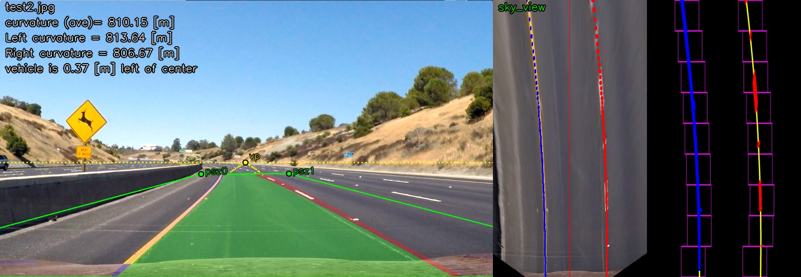

<!-- https://github.com/adam-p/markdown-here/wiki/Markdown-Cheatsheet#code -->
# **P2 - Advanced Road Lane Lines Finding** 

### **Description**

When we drive, we use our eyes to decide where to go. The lines on the road that show us where the lanes are act as our constant reference for where to steer the vehicle (depending on lines curvature).  Naturally, one of the first things we would like to do in developing a self-driving car is to automatically detect lane lines using an algorithm then extract some of their features. This project detect lane lines and features like curvate, finding a surface projection and a relation bewteen images world and real world. I used the tools that I learned about in the lesson (Computer Vision Fundamentals, Camera Calibration, Gradients and Color Spaces, and advanced computer vision from Udacity's Self driving car nano degree).

  

*Figure 1 - Result of curving lane lines finding process*

The goals / steps of this project are the following:

* Compute the camera calibration matrix and distortion coefficients given a set of chessboard images.
* Apply a distortion correction to raw images.
* Use color transforms, gradients, etc., to create a thresholded binary image.
* Apply a perspective transform to rectify binary image ("birds-eye view").
* Detect lane pixels and fit to find the lane boundary.
* Determine the curvature of the lane and vehicle position with respect to center.
* Warp the detected lane boundaries back onto the original image.
* Output visual display of the lane boundaries and numerical estimation of lane curvature and vehicle position.

<!-- [Rubric = https://review.udacity.com/#!/rubrics/571/view -->
---

### **Used Methods**

The tools that I used for pipline are color spaces (HSV and HLS), regions of interest, Gaussian smoothing (filters), Canny Edge Detection, Hough LineTransform  detection, Histograms peaks, sliding window, transformation matrix for surface projection and others. To achieve the goal was pieced together a pipeline to detect the lane lines of each side of the road for images and videos. The curvatures of lines were calcualted to later estimate the car's stering and position respecto to lane lines center.

---

### **How to run**

To run the pipeline just run in a prompt the command:

```clear && CarND-P2-Advanced_Lane_Lines_Finding.py```

Tested on: python 2.7 (3.X should work), OpenCV 3.0.0 (Higher version should work), UBUNTU 16.04.

Feel free to change any input argument of any function explained next.

---

### **Code Description**

### 1. Camera Calibration

OpenCV functions and other methods were used to calculate the correct camera matrix and distortion coefficients using the calibration chessboard images provided in the repository (x6 chessboard images). The distortion matrix was used to un-distort one of the calibration images provided as a demonstration that the calibration is correct. 

  

*Figure 2 - Result of camera calibration*

### 1. Others

Describe how (and identify where in your code) you used color transforms, gradients or other methods to create a thresholded binary image. Provide an example of a binary image result.

Describe how (and identify where in your code) you performed a perspective transform and provide an example of a transformed image.

Describe how (and identify where in your code) you identified lane-line pixels and fit their positions with a polynomial?

Describe how (and identify where in your code) you calculated the radius of curvature of the lane and the position of the vehicle with respect to center.

Provide an example image of your result plotted back down onto the road such that the lane area is identified clearly.

Provide a link to your final video output. Your pipeline should perform reasonably well on the entire project video (wobbly lines are ok but no catastrophic failures that would cause the car to drive off the road!)

---
### **Results**

Result with test videos here:  

1. [CarND-P2-Adavenced_Lane_Lines_Finding-project_video](https://www.youtube.com/watch?v=vOMT9DGa2Bw)  
2. [CarND-P2-Adavenced_Lane_Lines_Finding-challenge_video](https://www.youtube.com/watch?v=1VgXQWhJjMw)  
3. [CarND-P2-Adavenced_Lane_Lines_Finding-harder_challenge_video](https://www.youtube.com/watch?v=IY_yvBPCamc)  

---
### **Potential Shortcomings**
  
* Shortcoming: Description
* Shortcoming: Description
* Shortcoming: Description

---
### **Possible Improvements**

* Improvements: Description
* Improvements: Description
* Improvements: Description

---
### **Discussion**

> **Date:** &nbsp; 03/02/2019  
> **Programmer:** &nbsp;John A. Betancourt G.  
> **Phone:** &nbsp;+57 (311) 813 7206 / +57 (350) 283 51 22  
> **Mail:** &nbsp;john.betancourt93@gmail.com / john@kiwicampus.com  
> **Web:** &nbsp;www.linkedin.com/in/jhon-alberto-betancourt-gonzalez-345557129  

<!-- Sorry for my English -->