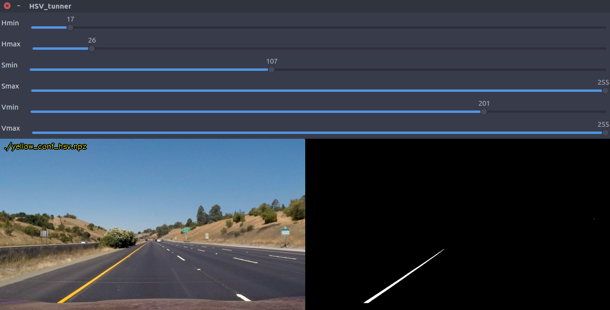
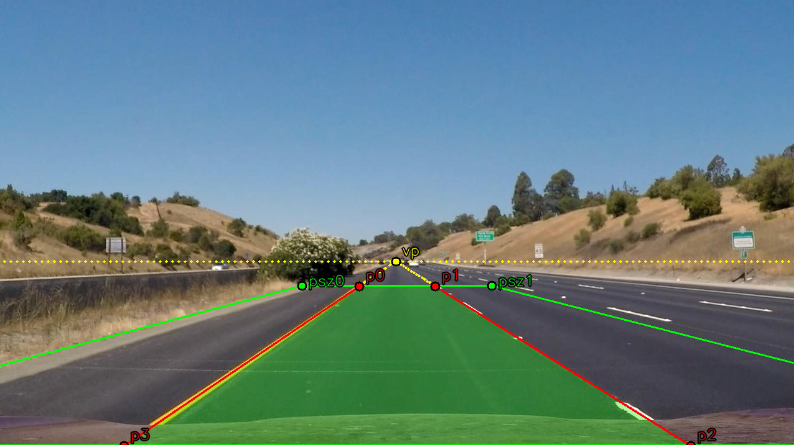

<!-- https://github.com/adam-p/markdown-here/wiki/Markdown-Cheatsheet#code -->
# **P2 - Advanced Road Lane Lines Finding** 

### **Description**

When we drive, we use our eyes to decide where to go. The lines on the road that show us where the lanes are act as our constant reference for where to steer the vehicle (depending on lines curvature). Naturally, one of the first things we would like to do in developing a self-driving car is to automatically detect lane lines using an algorithm, then extract some of their features. This project detect lane lines and curvature, first finding the surface projection of road and a relation between images world and real world. I used the tools that I learned about in the lesson (Computer Vision Fundamentals, Camera Calibration, Gradients, Color Spaces, and advanced computer vision techniques from Udacity's NanoDegree of Self driving cars).

 

*Figure 1 - Result of curving lane lines finding process*

The goals / steps of this project are the following:

* Compute the camera calibration matrix and distortion coefficients given a set of chessboard images.
* Apply a distortion correction to raw images.
* Use color transforms, gradients, etc., to create a thresholded binary image.
* Apply a perspective transform to rectify binary image ("birds-eye view").
* Detect lane pixels and fit to find the lane boundary.
* Determine the curvature of the lane and vehicle position with respect to center.
* Warp the detected lane boundaries back onto the original image.
* Output visual display of the lane boundaries and numerical estimation of lane curvature and vehicle position.

<!-- [Rubric = https://review.udacity.com/#!/rubrics/571/view -->
---

### **Used Methods**

The tools that I used for pipeline are color spaces (HSV and HLS), regions of interest, Gaussian smoothing (filters), Canny Edge Detection, Hough LineTransform detection, Histograms peaks, sliding window, transformation matrix for surface projection and others. To achieve the goal was pieced together in to a pipeline to detect the lane lines of each side of the road for images and videos. The curvatures of lines were calculated from a second order linear regression to later estimate the car's steering and position respect to road center.

---

### **How to run**

To run the pipeline just run in a prompt the command:

```clear && CarND-P2-Advanced_Lane_Lines_Finding.py```

Tested on: python 2.7 (3.X should work), OpenCV 3.0.0 (Higher version should work), UBUNTU 16.04.

Feel free to change any of the following hyper parameters:

    # process parameters    
    folder_dir_image = "./test_images"   # folder with images 
    folder_dir_video = "./test_videos"   # folder with videos 
    out_folder_image = "./output_images" # Output folder for images
    out_folder_video = "./output_videos" # Output folder for videos
    img_list = os.listdir(folder_dir_image)   # Images list
    video_list = os.listdir(folder_dir_video) # Videos list
    
    results_window_name = "surface_projection_result"
    show_process_calibration = True # Show process for camera calibration
    show_process_SurfaceProj = True # Sow process for surface projection
    show_process_images = True  # Show process for images
    show_process_videos = True # Show process for videos
    Save_results = False # Enable/Disable results saving

    # Variables for camera calibration
    cam_calibration_folder = "./camera_cal" # Folder path with chessboard images
    cam_calibration_file = "cam_calibration.npz" # File name to load/save calibration
    chessboard_vert_div = 6 # Number of vertical divisions in chessboard
    chessboard_hori_div = 9 # Number of horizontal divisions in chessboard

    # Color Thresholding Parameters
    Tune_ranges = False # Enable/Disable parameters tuning
    color_files_list = [
            './lane_lines_conf_hls.npz',
            './white_conf_hsv.npz',
            './yellow_conf_hsv.npz']

    # Projection Parameters
    projection_file = "projection_params.npz"
    UNWARPED_SIZE = (1280, 720) # Unwarped size (width, height)
    VERT_TRESH = 0.6 # Normalized value to ignore vertical image values
    HozBottom = 0 # Superior threshold value
    HozTop = 30 # Superior threshold value
    porc = 0.3 # percentage to adjust surface's geometry in UNWARPED_SIZE

    # Parameters for pixel relation
    pix_dashed_line = 50. # [pix] length of lane line
    x_distance_m = 3.7 # [m] road width or distance between lane lines
    y_distance_m = 3. # [m] length of lane line
    
    # Polynomial Fittig parameters
    nwindows = 9 # Number of sliding windows
    margin = 100 # width of the windows +/- margin
    minpix = 10  # minimum number of pixels found to recenter window


---

### **Code Description**

### **1. Camera Calibration**

<!-- 1.  Briefly state how you computed the camera matrix and distortion coefficients. Provide an example of a distortion corrected calibration image. -->

OpenCV functions and other CV methods were used to calculate the correct camera matrix and distortion coefficients using the calibration chessboard images provided in this repository (9x6 chessboard images). The distortion matrix was used to undistort one of the calibration images provided as a demonstration that the calibration is correct. 

The function ```calibrate_camera()``` in ```CarND-P2-Advanced_Lane_Lines_Finding.py``` performs the camera calibration. The input arguments are:

Input Arguments:
* folder_path: `string` - Folder path with chessboard images
* calibration_file: `string` - Name of the file for saving or load parameters
* n_x: `int` - Number of vertical intersections in chessboard
* n_y: `int` - Number of horizontal intersections in chessboard
* show_draws: `boolean` - Enable/Disable show chessboard detections for every image

Returns:
* mtx: `numpy.narray` - camera distortion matrix
* dist: `numpy.narray` - camera distortion vector

In ```calibrate_camera()``` fucntion the variable ```object_points``` is initialized with the (x, y, z) coordinates expected of the chessboard corners in the world. Here I am assuming that the chessboard is fixed on the (x, y) plane at z=0, such that the object points are the same for each calibration image in folder ```folder_path```. Thus, ```objp``` is just a replicated array of coordinates, and ```object_points``` will be appended with a copy of it every time function successfully detects all chessboard corners in a test image. ```image_points``` will be appended with the (x, y) pixel position of each of the corners in the image plane with each successful chessboard detection. The function ```cv2.cornerSubPix()``` is used to refine the corner locations, this adjustment leads to a higher precision.

Evey image to be processed is converted to gray scale, then using the function ```cv2.findChessboardCorners()``` the chessboard corners will be detected, and then the process is the already explained. 

 

*Figure 2 - Chessboard corners detection*

With all points appended in ```objobject_points``` and ```image_points``` I can compute the camera calibration and distortion coefficients using the function ```cv2.calibrateCamera()```. With the camera matrix, the distortion coefficients, a test image, and the function ```cv2.undistort()``` I got the next result:

 

*Figure 3 - Result of camera calibration*

If calibration succeeded, camera distortion parameters are saved in a ```npz``` file for later use.


### **2. Thresholded Binary Image**

<!-- 2.  Describe how (and identify where in your code) you used color transforms,  -->

I decided to explore my own methods and write all functions from scratch, so no given function was used or modified in this step. I used the same code used at [CarND-P1-Finding_Lane_Lines
](https://github.com/JohnBetaCode/CarND-P1-Finding_Lane_Lines) to get a binary mask. 

**Step 0**: &nbsp;I decided to use two HSV color spaces tunned to get a binary image (mask) with our objects of interest (White lane lines and Yellow lane lines). Setting a maximum and a minimum value for each parameter H (Hue), S (Saturation), and V (Value), then compile, see result, adjust and try again is bothersome, so I coded a simple tuner window for this. Using the function ```color_range_tunner()```  you can load stetted parameters and set new values for an image. So, I tuned the color ranges for white and yellow lane lines (```white_conf_hsv.npz``` and ```yellow_conf_hsv.npz```). If you don't tune any parameter, the function loads the stored parameters from a npz file. It’s possible to tune parameters for a different color space model instead of HSV like HLS or others supported by OpenCV. I only played with the HSV space, but HLS could work as well.

Let's work with this image:


*Figure 4 - Original image*  

Why this image? because the car is perfectly centered with the center of image and center of the road (trust me!), and this is perfect to find a good surface projection as we'll see later.

The color space tunning window is:

  
  

*Figure 5 - Color space tunning window*  

You can move the track bars and choose the ranges that you like most. With my chosen ranges let’s see how the main function ```find_lanelines()``` finds and returns the right and left lane lines. 

Consider the next **input arguments**:  
* img_src: &nbsp;`cv2.math` &nbsp;- input image to find and approximate left and right lane lines  
* COLOR_TRESH_MIN: &nbsp;`list` &nbsp;- Minimum parameters to color thresholding  
* COLOR_TRESH_MAX: &nbsp;`list` &nbsp;- Maximum parameters to color thresholding  
* COLOR_MODEL: &nbsp;`list` &nbsp;- Color space in cv2 interface to color thresholding  
* VERT_TRESH: &nbsp;`float` &nbsp;- Normalized value to ignore vertical image range  
* FILT_KERN: &nbsp;`int` &nbsp;- (odd) size/kernel of filter (Bilateral)  
  
** Step 1**: &nbsp;The first thing is smooth the image with a bilateral filter with a kernel size given by “FILT_KERN”, but, why a bilateral filter? well, this kind of filters can reduce unwanted noise very well while keeping edges fairly sharp, but they are very slow compared to most filters. Is necessary the filter? Yes, because we want reduce small particles or noise for next steps.

  

*Figure 6 - Smoothed Image with bilateral filter*  
  
** Step 2**: &nbsp;From our tunned parameters we'll get a binary mask from every color space tunned (COLOR_TRESH_MIN, COLOR_TRESH_MAX, COLOR_MODEL), then apply a logical operator (OR) to combine every mask and compose just one image like in the picture bellow. In every mask, the image area above the threshold VERT_TRESH (image height normalized value) is ignored, in few words this is because we don't care the sky and others objects above this horizontal limit.

  

*Figure 7 - Binary image from color thresholding*  
  
with the function `load_color_spaces_ranges()` you can provide a list of npz files names of you tunned color spaces and get the necessary arguments with all color spaces.


### **2. Perspective transform Image**

<!-- Describe how (and identify where in your code) you performed a perspective transform and provide an example of a transformed image. -->

**Setp 3**: &nbsp;The image above looks great to apply a canny edge detector to get only contours from the binary mask. No matters what parameters are given since our image is a binary mask, so changes are gonna be too strong to be detected with any values (X and Y gradients): 

  

*Figure 8 - Contours by Canny edge detection algorithm*  
  
** Step 4**: &nbsp;Applying the Probabilistic Hough Line function we get the result shown in Figure 9. Setting the correct parameters to get these lines is about experience o just play for a while to get a decent result. The problem now is that we have undesirable red lines in some scenarios. So, the the question now is how do we distinguish what lines we want?, and what lines belong to the right and left side of the road?.


*Figure 9 - Probabilistic Hough Line algorithm* 
  
** Step 5**: &nbsp; To distinguish what lines we want and what lines belong to the right and left side I use a simple heuristic. If the vehicle is properly centered in the road, the left and right lane lines always intersect the image in the bottom, and lines that we don't want intersect the image on the left and right side, the unwanted lines also have small angles close to 0. or 180. degrees, so, with some conditionals we can take only the lines that belong to the left and right lane lines. Finally to get just one line per side, we compute a simple linear regression with left and right lines coordinates. 

  

*Figure 10 - Hough Lines filtered and assigned with heuristic*
  
The function ```find_lanelines()```  **Returns**:
* Lm: `float`  linear regression slope of left lane line
* Lb: `float`  linear regression y-intercept of left lane line
* Rm: `float`  linear regression slope of right lane line
* Rb: `float`  linear regression y-intercept of right lane line  
* Left_Lines: `list` list of left lines with which left lane line was calculated
* Right_Lines: `list` list of right lines with which right lane line was calculated
  
If no left or right lane line is detected the function returns the parameters Lm, Lb, Rm, and Rb as None type respectively.

### **3. Polynomial Fitting**

<!-- Describe how (and identify where in your code) you identified lane-line pixels and fit their positions with a polynomial? -->
Next is explained how the polynomial fittings were calculated for images, for videos is quite similar and will be explained later.

**Step 6**: In order to adjust a geometry over the road surface, the function `find_projection()` returns the transformation matrix **(M)** to project the road's three-dimensional view in a dimensional space or bird eye view. For this operation we need four points in the original image (p1, p2, p3, and p4) to be projected in the projection size (pp1, pp2, pp2, pp3), this means that we should project spatially p1 in pp1, p2 in pp2 an so on. p1, p2, p3, and p4 are calculated from the left, right, superior and inferior lines intersections.

the Function `find_projection()` returns:

* M: `numpy.darray` transformation matrix 
* INVM: `numpy.darray` inverse of transformation matrix 
* src_points: `np.array` original size (p1, p2, p3, p4) [pix]
* dst_points: `np.array` Unwarped size (p1, p2, p3, p4) [pix]
* size_points: `np.array` Unwarped size (p1, p2, p3, p4) [pix]
* vp: `tuple` vanishing point (x, y) [pix]

  

*Figure 11 - Geometric or Polynomial Fitting over surface projection*

** Step 7**: Using the function `cv2.warpPerspective()` we can project the area given by the points p1, p2, p3 and p4 in the original image in
a new one which is called sky view as shown in figure 12, this image is filter using a bilateral filter. 

  


*Figure 12 - Left: Surface projection image - Right: Projection Image Filtered*

**Step 8**: With the function `get_binary_mask()` we get a binary mask applying the threshold tunned for every color space that we want, in this case HSV for white and yellow lines. Here the same parameters to find the surface projection are used.

  

*Figure 13 - Binary surface projection image*

### **4. Line Curvature**

<!-- Describe how (and identify where in your code) you calculated the radius of curvature of the lane and the position of the vehicle with respect to center. -->

**Step 9**: Finally, the function `fit_polynomial()` is used to detect the right and left lane line. This function start in bottom of image with a window center in the points p3->pp3 and p4-->pp4, for left and right window respectively. Then using the binary mask obtained in **step 8** the pixels in the window area are extracted. Due to in images there's no a previous polynomial fitting to center the iteration of windows, the windows will be centered if the amount of pixel are superior to a threshold. If there's no enough pixels in the window area, then a second binary mask will be obtained moving the value of V for HSV color model, this is good when the light conditions change suddenly or the road surface is too illuminated. More heuristic is used in this step but it will not be explained so as not to extend this report.

  

*Figure 14 - Lane lines finding with sliding window*

The function `fit_polynomial()` return:

* left_fit: `numpy.ndarray` second order linear regression of left lane line
* right_fit: `numpy.ndarray` second order linear regression of right lane line
* leftx: `numpy.ndarray` left lane line x coordinates 
* lefty: `numpy.ndarray` left lane line y coordinates 
* rightx: `numpy.ndarray` right lane line x coordinates 
* righty: `numpy.ndarray` right lane line y coordinates 
* out_img: `cv2.math` binary mask image with linear regression and windows drawings

**Step 10**:

**Step 11**:

### **5. Road Area Re-projection**

<!-- Provide an example image of your result plotted back down onto the road such that the lane area is identified clearly. -->


  
*Figure 15 - Lane lines reprojection in original image*

### **6. Results**

<!-- Provide a link to your final video output. Your pipeline should perform reasonably well on the entire project video (wobbly lines are OK but no catastrophic failures that would cause the car to drive off the road!) -->

 

*Figure 16 - Lane lines Finding in Videos*

  

*Figure 17 - Finding lane lines with road light conditions changing*

1. [CarND-P2-Adavenced_Lane_Lines_Finding-project_video](https://youtu.be/Iv7EgYnxOWA) 
2. [CarND-P2-Adavenced_Lane_Lines_Finding-challenge_video](https://youtu.be/Iv7EgYnxOWA) 
3. [CarND-P2-Adavenced_Lane_Lines_Finding-harder_challenge_video](https://giphy.com/gifs/mrw-oc-asks-wYyTHMm50f4Dm/fullscreen) 

---
### **Potential Shortcomings**
* Camera Calibration: Chess board printed in a sheet of paper, seriously Udacity?
* White and Yellow Objects: If an object in scene appear and has the same or similar color of lane line will be segmented in the binary mask, and maybe due its geometry some lines could be included in the linear regression calculation and this could lead to a bad or wrong lane line approximation.
* Lighting conditions: In hard and real scenarios the light conditions always are gonna change due to shadows, light sources, objects, and others. This problem causes that the segmentation algorithm tunned for a specific environmental conditions dont work properly in others.
* Perspective Changes: When the car pass through a pothole, the car's pitch angle change and the surface projection should change as well, but it doesn't, so the vertical and horizontal pixel relation is not correct, and so the lane line curvature measurement is wrong. 
* Too much parameters to tune up: There's too much to play with, move up or move down a parameter or other could affect or improve a specific image or video conditions, maybe the static parameters is not the final solution for this problem, others methods can be explored to find the correct parameters with extracting more information of car's environment.

---
### **Possible Improvements**

* Camera Calibration: There's some techniques and function to detect how god the camera calibration is, one of these can be implemented to know if the current calibration is good enough for our propose. One example is Re-projection error which gives a good estimation of just how exact the found parameters are.
* Lighting conditions: More robust methods for a adaptive color space thresholding values when light condition change.
* Perspective Changes: With car's IMU information and satanic methods is possible correct the surface projection on real time, which is image stabilization. In this way the process will be more robust to potholes and road imperfections that produce vibrations in the surface projection images  which leads to a wrong curvature measure or imprecise value.


---
### **Discussion**

The process of geometric camera calibration (camera re-sectioning) is a fundamental step for machine vision and robotics applications. Unfortunately, the result of the calibration process can vary a lot depending on various factors. 

The pattern size and quality is of extreme importance. Let’s consider the case of a chessboard pattern. The calibration process requires to detect the inner corner of the chessboard and the assumption of the algorithm is that every chessboard square is a perfect square. Another assumption is, hence, that the pattern is **perfectly planar***. So, DO NOT print the pattern at home. Seriously. Go to a professional print shop and ask them to create the pattern for you. They have the right software to create the chessboard with squares with the real desired square size with an extremely high accuracy. More than everything, they can print the pattern on a white opaque, rigid and planar material. Stress the print shop to print on some extremely rigid opaque white material. *"Images in this repository are just for explanation but are really bad to calibrate the camera"*. Click here for [Camera calibration guidelines](https://pgaleone.eu/computer-vision/2018/03/04/camera-calibration-guidelines/).

---

> **Date:** &nbsp; 03/17/2019  
> **Programmer:** &nbsp;John A. Betancourt G.   
> **Mail:** &nbsp;john.betancourt93@gmail.com  
> **Web:** &nbsp; www.linkedin.com/in/jhon-alberto-betancourt-gonzalez-345557129 

  

<!-- Sorry for my English -->